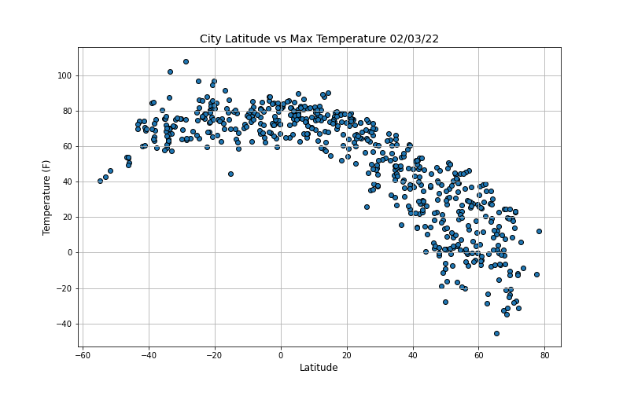
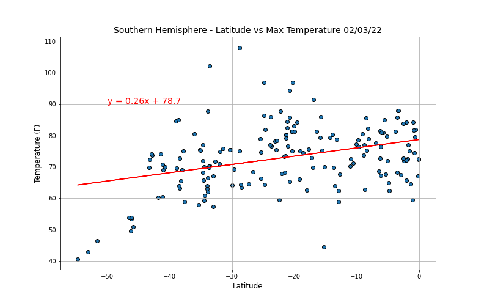
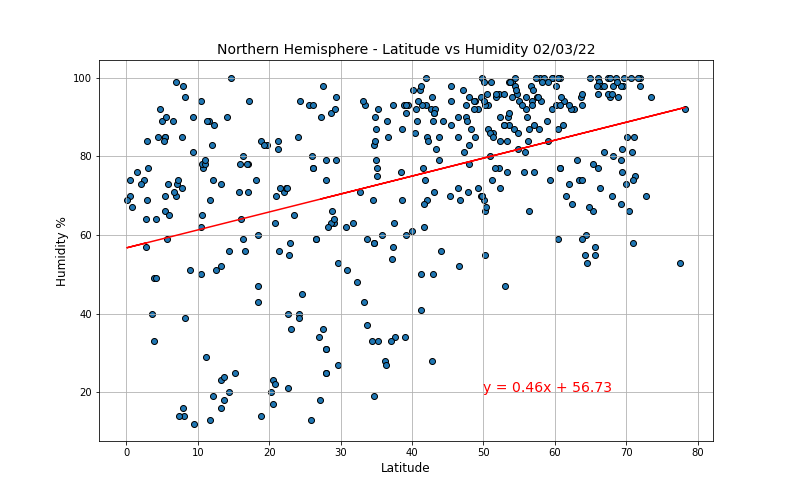
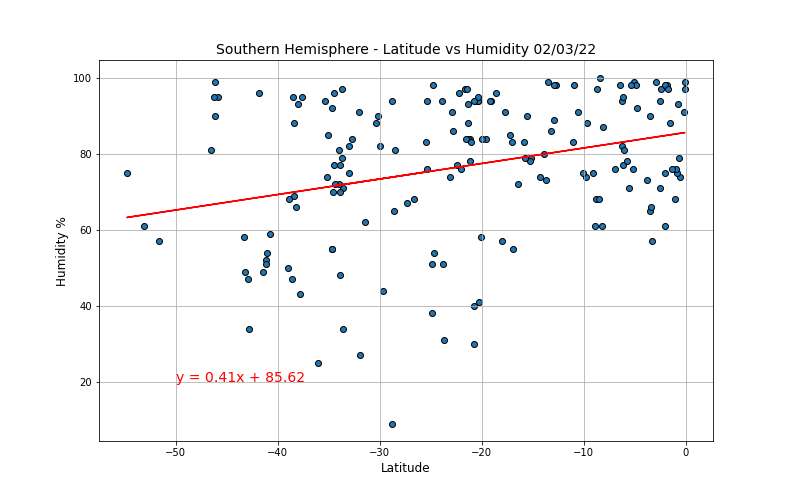
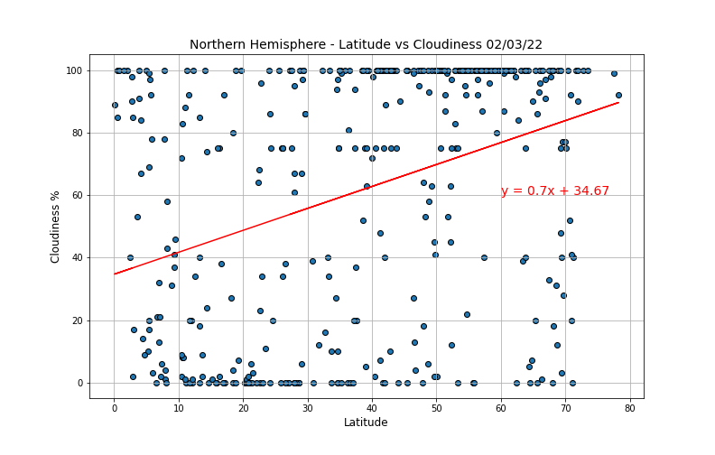
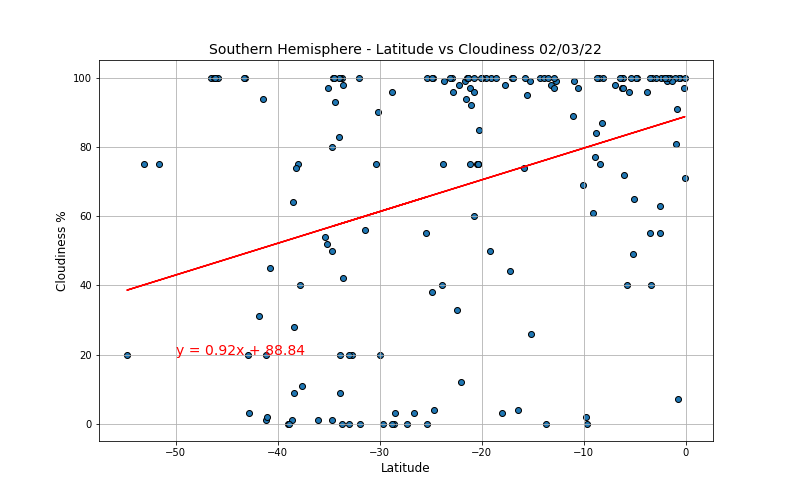
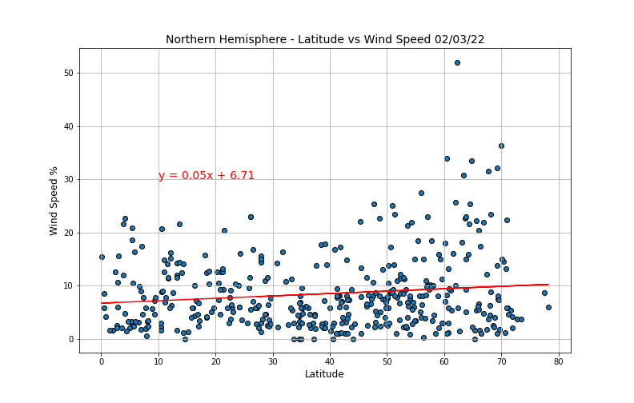
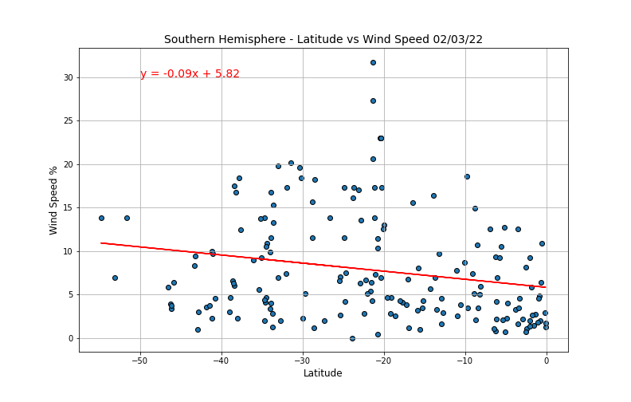
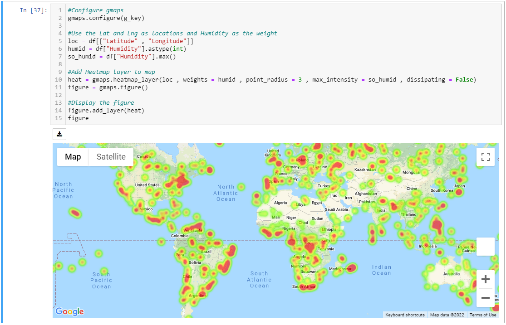

# Python API Homework - What's the Weather Like?

## Background

Whether financial, political, or social -- data's true power lies in its ability to answer questions definitively. So let's take what you've learned about Python requests, APIs, and JSON traversals to answer a fundamental question: "What's the weather like as we approach the equator?"

Now, we know what you may be thinking: _"Duh. It gets hotter..."_

But, if pressed, how would you **prove** it?

## Part I - [WeatherPy](starter_code/WeatherPy.ipynb)

In this example, you'll be creating a Python script to visualize the weather of 500+ cities across the world of varying distance from the equator. To accomplish this, you'll be utilizing a [simple Python library](https://pypi.python.org/pypi/citipy), the [OpenWeatherMap API](https://openweathermap.org/api), and a little common sense to create a representative model of weather across world cities.

The first requirement is to create a series of scatter plots to showcase the following relationships:

* Temperature (F) vs. Latitude

  

           
Scatter PLot

           
 

  

* Humidity (%) vs. Latitude

  

           
Scatter PLot

           
 

  

* Cloudiness (%) vs. Latitude

  

           
Scatter PLot

           
 

  

* Wind Speed (mph) vs. Latitude

  

           
Scatter PLot

           
 

  

- - - 

After each plot, add a sentence or two explaining what the code is analyzing.

The second requirement is to run linear regression on each relationship. This time, separate the plots into Northern Hemisphere (greater than or equal to 0 degrees latitude) and Southern Hemisphere (less than 0 degrees latitude):

* Northern Hemisphere - Temperature (F) vs. Latitude

  

           
Regression

           
 

  

  
* Southern Hemisphere - Temperature (F) vs. Latitude

  

           
Regression

           
 

  

* Northern Hemisphere - Humidity (%) vs. Latitude

  

           
Regression

           
 

  

* Southern Hemisphere - Humidity (%) vs. Latitude

  

           
Regression

           
 

  

* Northern Hemisphere - Cloudiness (%) vs. Latitude

  

           
Regression

           
 

  

* Southern Hemisphere - Cloudiness (%) vs. Latitude

  

           
Regression

           
 

  

* Northern Hemisphere - Wind Speed (mph) vs. Latitude

  

           
Regression

           
 

  

* Southern Hemisphere - Wind Speed (mph) vs. Latitude

  

           
Regression

           
 

  

 - - -

After each pair of plots, take the time to explain what the linear regression is modeling. For example, describe any relationships you notice and any other analysis you may have.

Your final notebook must:

* Randomly select **at least** 500 unique (non-repeat) cities based on latitude and longitude.
* Perform a weather check on each of the cities using a series of successive API calls.
* Include a print log of each city as it's being processed with the city number and city name.
* Save a CSV of all retrieved data and a PNG image for each scatter plot.

### Part II - [VacationPy](starter_code/VacationPy.ipynb)

Now let's use your skills in working with weather data to plan future vacations. Use jupyter-gmaps and the Google Places API for this part of the assignment.

To complete this part of the assignment,you will need to do the following:

* Create a heat map that displays the humidity for every city from Part I.

  

* Narrow down the DataFrame to find your ideal weather condition. For example:

  * A max temperature lower than 80 degrees but higher than 70.

  * Wind speed less than 10 mph.

  * Zero cloudiness.

  * Drop any rows that don't contain all three conditions. You want to be sure the weather is ideal.

  * **Note:** Feel free to adjust to your specifications but be sure to limit the number of rows returned by your API requests to a reasonable number.

* Using Google Places API to find the first hotel for each city located within 5000 meters of your coordinates.

* Plot the hotels on top of the humidity heatmap with each pin containing the **Hotel Name**, **City**, and **Country**.

  
